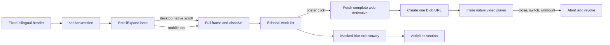

# Motion Scroll Expand

Date: 2026-08-25

## Outcome

Add a bilingual Motion section between Projects and Activities. The section opens with a cinematic Scroll Expand transition, then presents two complete films in an editorial alternating layout. Desktop progress follows native page scroll. Mobile uses one explicit tap. Playback is opt-in and is mounted inline only after the selected media has been fetched into a Blob URL.

## Requirements and boundaries

- Navigation order is Projects, Motion, Activities, Contact.
- The fixed global header remains available throughout the section.
- The generated WUJI frame expands toward full viewport, holds briefly, then dissolves into the site's normal themed background.
- The section subtitle is `多种不同的影像实践；持续更新中` and its aligned English translation.
- No autoplay, nested scroller, wheel interception, forced scroll position, or artificial input delay.
- The exit uses a shallow masked blur veil and additional spatial runway. It suggests resistance without changing scroll physics.
- Blob URLs discourage casual direct reuse but are not a security boundary. Full media remains retrievable by a determined visitor.

## Interaction architecture

1. `Motion.astro` server-renders `section#motion`, so the existing navigation scroll spy can discover it before React hydration.
2. `ScrollExpand.tsx` reads page scroll in a single passive listener and one requestAnimationFrame per paint. Expansion runs from 0 to 55 percent, hold from 55 to 75 percent, and dissolve from 75 to 95 percent.
3. Coarse-pointer or narrow viewports use a visible 44px tap control. Reduced-motion users receive a static editorial frame with no animated expansion.
4. `MotionPortfolio.tsx` owns the single active player. Selecting a different work aborts and releases the prior Blob URL.
5. Fetch progress, failure, close, and replay states remain visible in the poster area. Native video controls preserve keyboard and platform behavior.

## Principles re-check

| Principle | Concrete application |
|---|---|
| Intent alignment | The hero frame leads directly into the works; each poster has one primary action, Play film. |
| Cognitive load | Only one player can be active, and metadata is limited to format, role, and duration. |
| Status visibility | `MotionPortfolio.tsx` shows loading percentage, ready playback, and actionable errors in place. |
| Forgiveness | A visible close control releases the active media; selecting another work is reversible. |
| Affordance | Posters use a real button overlay, 44px controls, hover, pressed, and focus-visible states. |
| Good design disappears | Native scroll and native video controls carry the interaction without a tutorial. |
| No manual required | Desktop uses scroll; mobile exposes a plainly labelled tap action. |
| Respect time | Posters load initially; complete films are fetched only after intent and can be aborted. |
| Honesty | The site does not label Blob delivery as download protection or DRM. |
| One primary action | Each work row has one Play film action; Close appears only while a player is active. |
| Traceability | Film-load intent uses the existing privacy-minimal aggregate analytics path. |

## Cross-cutting conventions audit

| Convention | Check |
|---|---|
| i18n | Navigation, section copy, work metadata, player state, and controls have aligned English and Chinese strings. |
| Typography | Existing Geist, display serif, and site text tokens are reused. |
| Layout | The section uses the existing 72rem content wrapper and responsive section spacing. |
| Navigation | `motion` and `campus` keys match server-rendered section IDs. |
| Theme | Surfaces and text use global tokens; the generated frame is shared because it is photographic content. |
| Input | Pointer, touch, keyboard, reduced motion, and native video controls are supported. |
| Privacy | The new event name is allowlisted on both client and server; no visitor identifier is added. |
| Performance | Scroll writes only transform, clip-path, and opacity in requestAnimationFrame; media is click-loaded. |

## Acceptance

- Header links reach Motion and Activities in both desktop and mobile navigation.
- Desktop expansion, hold, and dissolve are smooth without changing native scroll position.
- Mobile tap reveals the full frame and reduced motion disables the animated sequence.
- Switching language or theme does not reset an active film or change section geometry materially.
- A second film selection aborts and revokes the first Blob URL; close and unmount also release it.
- Both web derivatives are complete-duration, below 25 MiB, and absent from initial network requests.
- Astro check, production build, keyboard pass, desktop Safari-class viewport, and 390px visual checks pass.
